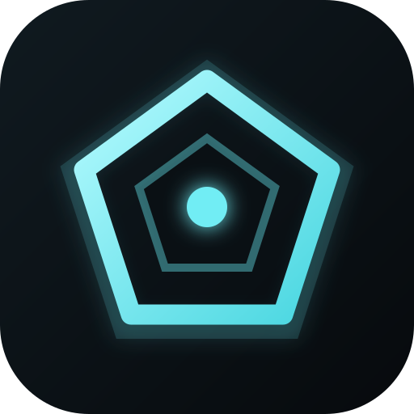
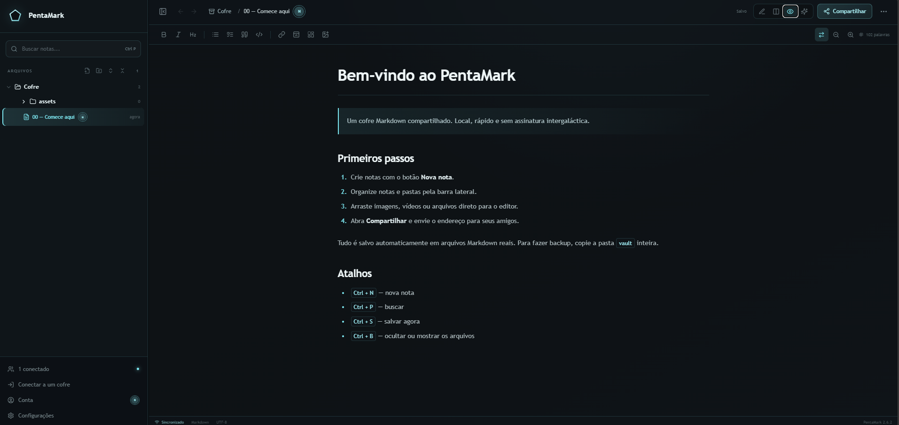
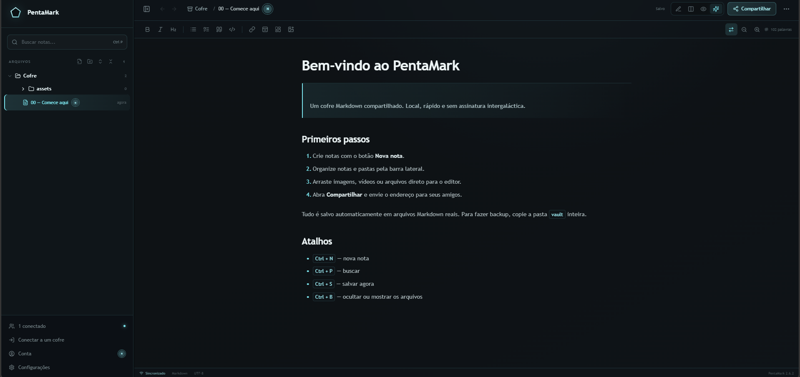

<div align="center">
  
  <h1>PentaMark</h1>
  <p><strong>Editor Markdown local, colaborativo e baseado em arquivos abertos.</strong></p>

  <p>
    
    
    
    
  </p>
</div>

O PentaMark é um editor Markdown self-hosted que roda no seu computador e pode ser acessado pelo navegador através da rede local ou de uma VPN. As notas continuam sendo arquivos `.md` reais: sem banco proprietário e sem prender o cofre ao aplicativo.

## Visão geral

| Somente Leitura | Live Preview |
| --- | --- |
|  |  |

O Somente Leitura é a fonte visual do documento. O Live Preview usa os mesmos componentes, tokens e contrato de layout, revelando os delimitadores Markdown somente no conteúdo tocado pelo cursor.

## Recursos

- Cofres formados por pastas e arquivos Markdown reais.
- Acesso por `localhost`, rede local, Radmin VPN, Tailscale ou ZeroTier.
- Edição sincronizada entre computadores e celulares.
- Live Preview com cursor, seleção e markers contextuais.
- Perfis de Leitor, Editor e Admin.
- Presença e cursores remotos.
- Histórico, lixeira e recuperação de conflitos.
- Wikilinks, embeds, propriedades YAML e callouts do Obsidian.
- Mermaid, tabelas, syntax highlighting e Kanban editável.
- Ponte MCP para acesso ao cofre por Codex/IA.
- PWA instalável pelo navegador.

## Executar no Windows

Requisitos: [Node.js](https://nodejs.org/) 20 ou superior.

1. Clone ou baixe o projeto.
2. Execute `Iniciar-PentaMark.bat`.
3. O PentaMark prepara o frontend e abre o endereço local automaticamente.

Também é possível iniciar manualmente:

```bash
npm install
npm run local:build
node local/server.mjs
```

No Linux/macOS:

```bash
chmod +x Iniciar-PentaMark.sh
./Iniciar-PentaMark.sh
```

## Compartilhar na rede

Com o host aberto, clique em **Compartilhar** e envie um dos endereços exibidos. Os outros dispositivos acessam o mesmo cofre pelo navegador; notas e anexos continuam armazenados somente no host.

Para acesso fora da rede local, use uma VPN privada como Radmin VPN, Tailscale ou ZeroTier. Não exponha o servidor diretamente à internet sem autenticação e proxy adequados.

## Compatibilidade Markdown e Obsidian

```md
[[Pasta/Nota]]
[[Pasta/Nota|apelido]]
![[assets/imagem.png|320]]
==texto destacado==

> [!tip] Callout
> Conteúdo do callout.
```

Também são reconhecidos:

- imagens, áudio, vídeo e PDF;
- propriedades YAML;
- links Markdown relativos;
- blocos Mermaid;
- blocos de código com syntax highlighting;
- Kanban horizontal e vertical.

## Ponte Codex / MCP

Em **Configurações → Ponte IA · Codex / MCP**, o host pode ativar uma URL MCP autenticada. Ela permite que ferramentas compatíveis listem, busquem, leiam e editem o cofre sob demanda, sem copiar todas as notas para outra máquina.

O token da ponte concede acesso ao cofre e deve ser compartilhado somente com pessoas autorizadas.

## Desenvolvimento

```bash
npm install
npm run dev       # frontend Vite
npm run check     # TypeScript + build local
```

Principais áreas:

```text
src/app/                         aplicação e composição da interface
src/features/markdown/           renderização e contrato visual do documento
src/features/editor/             CodeMirror e Live Preview
src/components/                  diálogos, presença e componentes de UI
local/server.mjs                 host local e persistência do cofre
local/mcp-bridge.source.mjs      ponte MCP
desktop/                         integração Electron
```

Veja [ARCHITECTURE.md](ARCHITECTURE.md) para as fronteiras completas da arquitetura.

## Dados do cofre

Por padrão:

```text
vault/
├── notes/       notas Markdown
├── assets/      anexos
├── .history/    versões anteriores
└── .trash/      itens removidos
```

Também é possível abrir qualquer pasta externa como cofre. Para backup, copie a pasta escolhida inteira.

## Roadmap

- [x] Host local acessível pelo navegador.
- [x] Live Preview inteligente.
- [x] Colaboração, presença e permissões.
- [x] Compatibilidade com formatos do Obsidian.
- [x] Ponte Codex / MCP.
- [ ] Distribuição portátil `.exe` para Windows.
- [ ] Aplicativo mobile dedicado.

---

<div align="center">
  Projetado para quem valoriza a propriedade dos próprios arquivos e a colaboração em tempo real.
</div>
